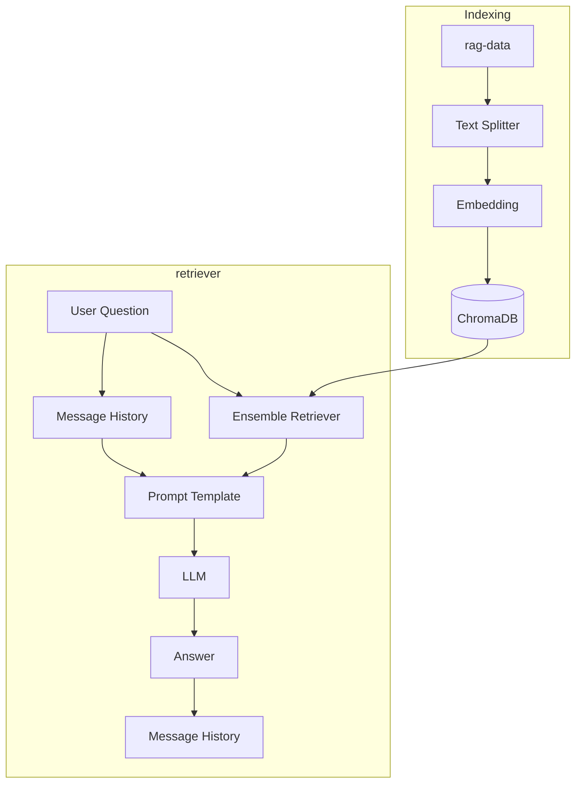

# RAG Chatbot

LangChain 기반의 Retrieval-Augmented Generation(RAG) 챗봇 프로젝트

대화 기록을 관리하여 멀티턴 대화를 지원, LangSmith를 이용한 체인 추적(Tracing) 환경을 구성


# 주요 기능

* 문서 임베딩 및 ChromaDB 인덱싱
* Hybrid Retrieval

  * Dense Retrieval (Embedding)
  * Sparse Retrieval (BM25)
* LangChain 기반 RAG Pipeline
* 대화 기록(Message History) 관리
* FastAPI 기반 API 서버
* LangSmith Tracing 지원
* (예정) Gemini를 활용한 RAG 자동 평가


# 사용 기술

| 분야              | 기술                                    |
| ---------------- | -------------------------------------- |
| Framework        | LangChain                              |
| API              | FastAPI                                |
| Vector DB        | ChromaDB                               |
| Dense Embedding  | Ollama - bge-m3                         |
| Sparse Retrieval | BM25                                   |
| LLM              | Ollama - gemma4:e2b-mlx                |
| Evaluation       | Gemini 2.5 Flash (예정)                 |
| Tracing          | LangSmith                              |

---

# 프로젝트 구조

```text
.
├── README.md
├── chroma_db                 # ChromaDB 저장소
├── data
│   ├── model-data            # 모델 관련 데이터
│   └── rag-data              # RAG 문서
├── eval                      # 평가 코드
├── ingest.py                 # 문서 임베딩 및 인덱싱
├── src
│   ├── api
│   │   └── main.py           # FastAPI 서버
│   ├── memory_manager.py     # 대화 기록 관리
│   ├── rag_manager.py        # RAG 체인 생성 및 실행
│   └── vector_store_manager.py # Vector Store 생성 및 Retriever 관리
├── doc                       # 프로젝트 회고
├── pyproject.toml
└── uv.lock
```


# 동작 과정



# 환경 변수

`.env` 파일을 생성한 후 아래 환경 변수를 설정합니다.

| 변수                   | 설명                             | 필수 여부       |
| -------------------- | ------------------------------ | ----------- |
| `LANGSMITH_TRACING`  | LangSmith Tracing 활성화 (`true`) | 선택          |
| `LANGSMITH_ENDPOINT` | LangSmith API Endpoint         | 선택          |
| `LANGSMITH_API_KEY`  | LangSmith API Key              | 선택          |
| `LANGSMITH_PROJECT`  | LangSmith 프로젝트 이름              | 선택          |
| `LLM_PROVIDER`       | 사용할 LLM (`google` 또는 `ollama`) | 필수          |
| `GOOGLE_API_KEY`     | Google AI API Key              | Google 사용 시 |
| `GOOGLE_MODEL`       | Google 모델명                     | Google 사용 시 |
| `OLLAMA_MODEL`       | Ollama 모델명                     | Ollama 사용 시 |
| `OLLAMA_BASE_URL`    | Ollama 서버 주소                   | Ollama 사용 시 |

### 예시

```env
# LangSmith
LANGSMITH_TRACING=true
LANGSMITH_ENDPOINT=https://api.smith.langchain.com
LANGSMITH_API_KEY=your_api_key
LANGSMITH_PROJECT=my-rag

# LLM Provider
LLM_PROVIDER=ollama

# Google
GOOGLE_API_KEY=
GOOGLE_MODEL=gemini-2.5-flash

# Ollama
OLLAMA_MODEL=gemma4:e2b-mlx
OLLAMA_BASE_URL=http://localhost:11434
```

# 현재 구현 상태

* [x] 문서 인덱싱
* [x] ChromaDB 구축
* [x] Dense Retriever
* [x] BM25 Retriever
* [x] Hybrid Retrieval
* [x] LangChain RAG Pipeline
* [x] Message History
* [x] FastAPI API
* [x] LangSmith Tracing
* [x] LangSmith Evaluation


